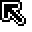
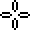
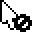
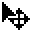
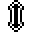
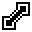
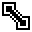

# MouseCursor

Mouse cursor that can be set in a [canvas widget](dialog.md#dialogcanvas) using:

```lua
dialog:modify{ id=canvasId, mousecursor=newMouseCursor }
```

## MouseCursor.NONE


## MouseCursor.ARROW



## MouseCursor.CROSSHAIR



## MouseCursor.POINTER


## MouseCursor.NOT_ALLOWED



## MouseCursor.GRAB


## MouseCursor.GRABBING


## MouseCursor.MOVE



## MouseCursor.NS_RESIZE



## MouseCursor.WE_RESIZE


## MouseCursor.N_RESIZE


## MouseCursor.NE_RESIZE



## MouseCursor.E_RESIZE


## MouseCursor.SE_RESIZE



## MouseCursor.S_RESIZE


## MouseCursor.SW_RESIZE


## MouseCursor.W_RESIZE


## MouseCursor.NW_RESIZE


